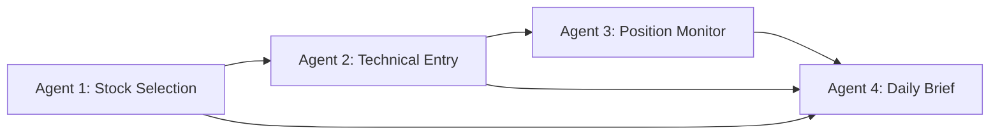

# US Stock Wait & See Agent System Design

> ระบบช่วยคัดกรอง วิเคราะห์ ติดตาม และสรุปหุ้นอเมริการายตัว สำหรับกลยุทธ์ Wait & See โดยเน้นหุ้นที่ย่อตัวแรงแต่พื้นฐานยังดี และหุ้น growth คุณภาพสูง

หมายเหตุ: ระบบนี้มีเป้าหมายเพื่อช่วยตัดสินใจ ไม่ใช่ระบบสั่งซื้อขายอัตโนมัติ การตัดสินใจขั้นสุดท้ายควรเป็นของผู้ลงทุนเสมอ

## 1. System Objective

เป้าหมายของระบบคือสร้าง workflow ที่ช่วยตอบคำถามหลัก 4 ข้อ:

1. หุ้นตัวไหนในตลาดอเมริกาน่าสนใจพอให้ติดตาม
2. หุ้นตัวนั้นมีแนวรับ แนวต้าน และจุดเข้าซื้อที่เหมาะสมหรือไม่
3. หลังจากเข้าซื้อหรืออยู่ใน watchlist แล้ว สถานการณ์เปลี่ยนไปอย่างไรในแต่ละวัน
4. ข้อมูลทั้งหมดควรถูกสรุปให้เข้าใจง่ายพร้อม action suggestion อย่างไร

เงื่อนไขผู้ใช้งาน:

- สินทรัพย์: หุ้นอเมริการายตัว
- งบประมาณ: 100,000 บาท
- ระยะเวลาถือ: มากกว่า 6 เดือน
- ความเสี่ยงที่รับได้: ขาดทุนสูงสุดประมาณ -20% ต่อแผน
- เวลาสรุปรายงาน: ทุกวันเวลา 09:00 น. ตามเวลาไทย
- รูปแบบคำตอบ: ให้คะแนนพร้อม action suggestion

## 2. Agent Architecture

ระบบประกอบด้วย 4 agents หลัก:

1. Stock Selection Agent
2. Technical Entry Agent
3. Position Monitor Agent
4. Daily Brief Agent

ภาพรวมการทำงาน:



หลักการสำคัญ:

- Agent 1 คัดหุ้นที่มีคุณภาพพอ
- Agent 2 วิเคราะห์ว่าราคาน่าสนใจหรือยัง
- Agent 3 ติดตามการเปลี่ยนแปลงรายวัน
- Agent 4 สรุปผลทั้งหมดเป็นรายงานที่มนุษย์อ่านและตัดสินใจได้

## 3. Agent 1: Stock Selection Agent

### หน้าที่

คัดเลือกหุ้นอเมริกาที่เข้าข่าย "พื้นฐานดีและน่าติดตาม" จาก universe ขนาดใหญ่ โดยเน้น 2 กลุ่ม:

- Quality Growth Pullback: หุ้นเติบโตคุณภาพดีที่ราคาย่อตัว
- Strong Business Deep Pullback: หุ้นธุรกิจแข็งแรงที่ถูกขายลงแรง แต่พื้นฐานยังไม่เสีย

### Universe เริ่มต้น

หุ้นอเมริกาทุกตัวที่ผ่าน liquidity filter:

- Listed ใน NYSE, Nasdaq หรือ AMEX
- Market cap มากกว่า 2B USD
- Average daily dollar volume มากกว่า 30M USD
- ราคาหุ้นมากกว่า 5 USD
- มีข้อมูลพื้นฐานเพียงพอสำหรับวิเคราะห์
- ไม่อยู่ในสถานะเสี่ยง delist

ค่า conservative ที่อาจใช้ในอนาคต:

- Market cap มากกว่า 10B USD
- Average daily dollar volume มากกว่า 100M USD

### Reject Rules

หุ้นจะถูกตัดออกทันทีหากพบเงื่อนไขใดเงื่อนไขหนึ่ง:

- Penny stock หรือ volume ต่ำ
- กำลังมีความเสี่ยง delisting
- ข่าว fraud, accounting issue, SEC investigation หรือ legal risk รุนแรง
- งบล่าสุดแย่ลงรุนแรงโดยไม่มีสัญญาณฟื้น
- หนี้สูงมากเมื่อเทียบกับ cash flow
- Dilution risk สูงจากการเพิ่มทุนบ่อย
- รายได้ชะลอแรง แต่ valuation ยังสูงผิดปกติ
- เป็นหุ้นที่ราคาลงแรงเพราะ thesis ธุรกิจเปลี่ยนเสียหาย

### Scoring Model

คะแนนเต็ม 100:

| หมวด | น้ำหนัก |
|---|---:|
| Quality & Fundamentals | 30 |
| Growth Durability | 20 |
| Balance Sheet / Cash Flow | 15 |
| Valuation vs Growth | 15 |
| Pullback Attractiveness | 10 |
| Liquidity & Tradability | 10 |

เกณฑ์ส่งต่อ:

- 80-100: คุณภาพสูงมาก ส่งให้ Agent 2 ทันที
- 70-79: ผ่านเกณฑ์ ส่งให้ Agent 2 แต่ติดธงให้ระวัง
- 55-69: เก็บไว้เป็น secondary watchlist
- ต่ำกว่า 55: ไม่ผ่าน

### Output

Agent 1 ต้องส่งข้อมูลในรูปแบบ:

```md
Ticker:
Company:
Sector:
Market Cap:
Selection Score:
Bucket: Quality Growth Pullback / Strong Business Deep Pullback
Reason:
Key Strengths:
Key Risks:
Pass/Reject:
```

## 4. Agent 2: Technical Entry Agent

### หน้าที่

รับหุ้นที่ผ่านจาก Agent 1 แล้ววิเคราะห์จังหวะเข้าซื้อ โดยหา:

- แนวรับหลัก
- แนวต้านหลัก
- โซนเข้าซื้อ
- จุด invalidation
- risk/reward
- สัญญาณกลับตัว
- action suggestion ด้านเทคนิค

### Timeframe หลัก

สำหรับกลยุทธ์ถือมากกว่า 6 เดือน:

- Weekly chart: ใช้ดู trend ใหญ่
- Daily chart: ใช้ดูจุดเข้า จุดหลุด และสัญญาณกลับตัว
- Intraday chart: ใช้ประกอบเล็กน้อยเท่านั้น ไม่ควรเป็นตัวตัดสินหลัก

### สิ่งที่ต้องวิเคราะห์

แนวรับ:

- Previous swing low
- Moving average 50 วัน, 100 วัน, 200 วัน
- Prior resistance turned support
- High-volume price zone
- Gap support
- Fibonacci retracement ถ้าเหมาะสม

แนวต้าน:

- Previous swing high
- Supply zone
- เส้นค่าเฉลี่ยที่ราคายังยืนไม่ได้
- Gap resistance
- บริเวณที่เคยมี volume ขายสูง

สัญญาณกลับตัว:

- ราคาหยุดทำ lower low
- เริ่มทำ higher low
- Bullish engulfing, hammer หรือ strong close ใกล้ high
- Volume วันที่เด้งสูงกว่าวันก่อนหน้า
- RSI ฟื้นจากโซนต่ำ
- MACD momentum เริ่มดีขึ้น
- ราคายืนเหนือแนวรับได้อย่างน้อย 1-3 วัน

### Technical Scoring Model

คะแนนเต็ม 100:

| หมวด | น้ำหนัก |
|---|---:|
| แนวรับชัดเจน | 25 |
| Risk/Reward | 25 |
| สัญญาณกลับตัว | 20 |
| Trend ใหญ่ยังไม่เสีย | 20 |
| Volume Confirmation | 10 |

### Risk/Reward Rule

โดยทั่วไปควรเลือก setup ที่มี risk/reward อย่างน้อย 1:2

ตัวอย่าง:

- Entry: 100 USD
- Invalidation: 90 USD
- Risk: 10 USD
- Target แรก: 120 USD
- Reward: 20 USD
- Risk/Reward = 1:2

### Output

```md
Ticker:
Technical Score:
Trend Status:
Main Support:
Secondary Support:
Resistance:
Suggested Entry Zone:
Entry Trigger:
Invalidation:
First Target:
Second Target:
Risk/Reward:
Technical Action:
Reason:
```

## 5. Agent 3: Position Monitor Agent

### หน้าที่

ติดตามหุ้นใน watchlist และหุ้นที่ถืออยู่ทุกวัน หลังตลาดสหรัฐปิด โดยดูทั้งราคา กราฟ ข่าว และ thesis

### ข้อมูลที่ต้องติดตาม

- ราคาปิดล่าสุด
- การเปลี่ยนแปลงรายวัน
- ระยะห่างจากแนวรับและแนวต้าน
- Volume เทียบกับค่าเฉลี่ย
- ข่าวสำคัญของบริษัท
- ข่าว sector
- Earnings date
- Earnings result และ guidance
- Analyst revision ถ้ามี
- Insider transaction ถ้ามีนัยสำคัญ
- Market regime จาก SPY, QQQ และ VIX

### Thesis Check

ทุกวันควรตอบคำถาม:

- เหตุผลที่สนใจหุ้นตัวนี้ยังถูกต้องอยู่หรือไม่
- มีข่าวหรือข้อมูลใหม่ที่ทำให้พื้นฐานเปลี่ยนหรือไม่
- ราคายังเคารพแนวรับหลักหรือไม่
- มีสัญญาณควรเข้าซื้อ เพิ่ม ลด หรือขายหรือไม่
- ความเสี่ยงเพิ่มขึ้นหรือลดลงเมื่อเทียบกับวันก่อน

### Monitor Actions

Agent 3 สามารถให้สถานะได้ดังนี้:

- HOLD: ถือได้ เหตุผลยังไม่เปลี่ยน
- WAIT: ยังไม่ถึงจุดตัดสินใจ
- WATCH CLOSELY: ใกล้จุดเข้า จุดหลุด หรือจุดทำกำไร
- ADD: setup ยังดีและมีจังหวะเพิ่ม
- TAKE PARTIAL PROFIT: ควรพิจารณาขายบางส่วน
- REDUCE RISK: ลดขนาดเพราะความเสี่ยงเพิ่ม
- REVIEW THESIS: มีข้อมูลใหม่ที่ต้องทบทวน
- EXIT: แผนผิดหรือความเสี่ยงสูงเกินไป

### Output

```md
Ticker:
Last Close:
Daily Change:
Distance to Support:
Distance to Resistance:
News Summary:
Thesis Status:
Risk Status:
Monitor Action:
Reason:
```

## 6. Agent 4: Daily Brief Agent

### หน้าที่

รวมข้อมูลจาก Agent 1, Agent 2 และ Agent 3 แล้วสร้างรายงานภาษาไทยทุกวันเวลา 09:00 น. ตามเวลาไทย

รายงานต้อง:

- สั้นพออ่านได้ทุกวัน
- มีคะแนนและ action suggestion
- อธิบายเหตุผลตามข้อมูลจริง
- แยก watchlist กับ position ที่ถืออยู่
- ระบุสิ่งที่ต้องตัดสินใจวันนี้
- ไม่ใช้ภาษาฟันธงเกินจริง

### Daily Report Template

```md
# US Stock Wait & See Daily Brief

วันที่:
เวลา: 09:00 น. ไทย

## Market Regime

- SPY:
- QQQ:
- VIX:
- ภาพรวมตลาด: Risk-on / Neutral / Risk-off
- สรุป:

## Top Watchlist Today

| Ticker | Score | Action | เหตุผลสั้น |
|---|---:|---|---|

## Stocks Near Buy Zone

| Ticker | Support | Entry Trigger | Invalidation | R/R | Action |
|---|---:|---|---:|---:|---|

## Current Positions

| Ticker | Avg Cost | Last Price | P/L | Status | Suggested Action |
|---|---:|---:|---:|---|---|

## News & Thesis Check

- ...

## Today Decision Notes

- ...
```

## 7. Action Definitions

ระบบควรใช้ action ที่สั้น ชัด และสม่ำเสมอ:

| Action | ความหมาย |
|---|---|
| REJECT | ไม่ผ่านเกณฑ์ ไม่ต้องติดตาม |
| WATCH | หุ้นดี แตาราคายังไม่ถึงโซน |
| WAIT FOR CONFIRMATION | ถึงโซนแล้ว แต่ยังไม่มีสัญญาณกลับตัว |
| BUY ZONE | ราคาเข้าโซนน่าสนใจ ต้องเฝ้าใกล้ชิด |
| BUY FIRST TRANCHE | ผ่านเงื่อนไขซื้อไม้แรก |
| ADD | ถืออยู่และมีจังหวะเพิ่มตามแผน |
| HOLD | ถือได้ เหตุผลยังไม่เปลี่ยน |
| TAKE PARTIAL PROFIT | พิจารณาขายบางส่วนเพื่อทำกำไร |
| REDUCE RISK | ลดขนาดเพราะความเสี่ยงเพิ่ม |
| REVIEW THESIS | มีข้อมูลใหม่ ต้องทบทวนเหตุผลลงทุน |
| EXIT | ออกจากแผน เพราะ thesis หรือ technical เสีย |

## 8. Portfolio And Risk Rules

### งบประมาณ

งบเริ่มต้น 100,000 บาท ควรแปลงเป็น USD ตามอัตราแลกเปลี่ยนจริงในวันที่ลงทุน และควรเผื่อ:

- ค่าธรรมเนียมซื้อขาย
- ค่าแปลงเงิน
- spread ค่าเงิน
- ความเสี่ยง USD/THB

### Position Sizing

แม้เป็นเงินก้อนเดียว ไม่ควรซื้อหุ้นตัวเดียวเต็มพอร์ต

แนวทางเริ่มต้น:

- ถือหุ้น 3-5 ตัว
- หุ้นหนึ่งตัวไม่ควรเกิน 35-40% ของพอร์ต
- หุ้นรายตัวทั่วไปควรอยู่ที่ 20-30% ของพอร์ต
- เก็บเงินสดบางส่วนไว้รอจังหวะ

ตัวอย่าง:

| ส่วน | สัดส่วน |
|---|---:|
| หุ้น A | 30% |
| หุ้น B | 25% |
| หุ้น C | 25% |
| เงินสด | 20% |

### Maximum Drawdown

ผู้ใช้รับความเสี่ยงได้ประมาณ -20%

กติกา:

- หากหุ้นขาดทุน 7-12% ต้อง review thesis
- หากหุ้นขาดทุน 15% ต้องพิจารณาลดความเสี่ยง ถ้า technical หรือพื้นฐานเสีย
- หากหุ้นขาดทุนใกล้ 20% และ thesis ไม่ชัดเจน ต้องพิจารณา exit
- ไม่ถัวเฉลี่ยขาลงหากพื้นฐานแย่ลงหรือราคาหลุดแนวรับหลัก

### Red Flag Risk Rules

ต้องแจ้งเตือนทันทีหากเกิดเหตุการณ์:

- งบแย่กว่าคาดมาก
- Guidance ถูกปรับลงแรง
- ราคาหลุดแนวรับหลักพร้อม volume สูง
- ข่าวสอบสวน บัญชีผิดปกติ หรือ legal risk
- Credit rating ถูกลดอย่างมีนัยสำคัญ
- Market regime เปลี่ยนเป็น risk-off ชัดเจน
- หุ้น gap down เกิน 10% จากข่าวพื้นฐาน

## 9. Market Regime Filter

ก่อนให้ action ซื้อ ควรตรวจตลาดรวม:

- SPY อยู่เหนือหรือต่ำกว่าเส้น 50 วัน และ 200 วัน
- QQQ อยู่เหนือหรือต่ำกว่าเส้น 50 วัน และ 200 วัน
- VIX อยู่ในระดับปกติหรือสูงผิดปกติ
- ตลาดกำลังเข้าสู่ earnings season หรือมี event ใหญ่ เช่น Fed meeting

Market regime:

| Regime | เงื่อนไขโดยรวม | ผลต่อ action |
|---|---|---|
| Risk-on | SPY/QQQ ยังเป็นขาขึ้น VIX ไม่สูง | ซื้อได้ตาม setup |
| Neutral | ตลาดแกว่ง ยังไม่เสีย trend ใหญ่ | ลดขนาดไม้แรก หรือรอสัญญาณชัดขึ้น |
| Risk-off | ตลาดหลุดแนวรับใหญ่ VIX สูง | หลีกเลี่ยงการเปิด position ใหม่ ยกเว้น setup แข็งแรงมาก |

## 10. Decision Log

ทุก decision สำคัญควรถูกบันทึกไว้เพื่อใช้ทบทวนภายหลัง

ตัวอย่าง format:

```md
Date:
Ticker:
Decision: Watch / Buy / Add / Hold / Sell / Exit
Price:
Position Size:
Reason:
Fundamental Thesis:
Technical Setup:
Invalidation:
Target:
Risk:
Next Review Date:
```

เหตุผลที่ต้องมี decision log:

- ลดการตัดสินใจตามอารมณ์
- ตรวจสอบได้ว่าตอนซื้อคิดอะไร
- ช่วยให้พัฒนากลยุทธ์จากผลลัพธ์จริง
- ป้องกันการเปลี่ยนเหตุผลย้อนหลังเมื่อราคาผิดทาง

## 11. Data Sources ที่ต้องใช้ในอนาคต

ระบบจริงควรมีข้อมูลจากหลายแหล่ง:

- Price OHLCV รายวัน
- Financial statements
- Analyst estimates
- Earnings calendar
- Company news
- SEC filings
- Sector/industry data
- Market index data เช่น SPY, QQQ, VIX
- FX rate USD/THB

ข้อมูลที่ต้องอัปเดตทุกวัน:

- ราคาปิด
- Volume
- ข่าวล่าสุด
- สถานะเทียบกับแนวรับ/แนวต้าน
- Market regime

ข้อมูลที่อัปเดตเป็นรอบ:

- งบการเงิน
- valuation metrics
- analyst revisions
- earnings guidance
- long-term thesis

## 12. Implementation Roadmap

### Phase 1: Manual Workflow

- ใช้เอกสารนี้เป็น checklist
- เลือกหุ้นเองบางส่วน
- ให้ระบบช่วยจัดคะแนนและสรุป
- ยังไม่มี automation เต็มรูปแบบ

### Phase 2: Semi-Automated Screening

- ดึงรายชื่อหุ้นจาก universe ที่กำหนด
- คำนวณ liquidity filter
- คำนวณ scoring เบื้องต้น
- สร้าง watchlist อัตโนมัติ

### Phase 3: Technical Setup Automation

- ดึงราคา OHLCV
- หาแนวรับ แนวต้าน
- คำนวณ RSI, moving averages, volume
- ให้ action suggestion จากกติกาที่กำหนด

### Phase 4: Daily Monitoring

- ติดตาม watchlist และ positions ทุกวัน
- ดึงข่าวสำคัญ
- สรุปรายงาน 09:00 น. ไทย
- แจ้งเตือนเมื่อเกิด red flag

### Phase 5: Review And Improve

- เก็บ decision log
- วิเคราะห์ว่าคะแนนแบบไหนให้ผลดี
- ปรับ scoring weights
- ปรับ action rules จากผลลัพธ์จริง

## 13. Open Questions For Strategy Detail

ประเด็นที่ควรคุยต่อก่อนสร้าง Agent 2 แบบละเอียด:

- จะใช้ moving average เส้นใดเป็นหลัก
- จะนิยามแนวรับจาก swing low อย่างไร
- ต้องรอ confirmation กี่วัน
- RSI/MACD จะใช้เป็นเงื่อนไขบังคับหรือแค่ประกอบ
- การซื้อไม้แรกควรใช้กี่เปอร์เซ็นต์ของ position
- จุดขายทำกำไรแรกควรใช้แนวต้านหรือเปอร์เซ็นต์กำไร
- ถ้าหุ้นดีมากแต่ตลาดรวม risk-off ควรรอหรือซื้อไม้เล็ก
- ถ้าขาดทุนยังไม่ถึง -20% แต่ thesis เสีย ควร exit ทันทีหรือไม่

## 14. Summary

ระบบนี้ควรถูกออกแบบให้เป็น decision-support system ไม่ใช่ระบบเดาหุ้น

หลักคิดที่ต้องยึด:

1. กรองหุ้นคุณภาพก่อนดูกราฟ
2. ไม่ซื้อเพียงเพราะราคาลงแรง
3. รอแนวรับและสัญญาณกลับตัว
4. ให้คะแนนอย่างเป็นระบบ
5. จำกัดความเสี่ยงก่อนคิดเรื่องกำไร
6. ติดตามข่าวและ thesis ทุกวัน
7. สรุป action ให้ชัด แต่ให้มนุษย์ตัดสินใจสุดท้าย

กลยุทธ์ Wait & See ที่ดีคือการรออย่างมีเงื่อนไข และลงมือเมื่อข้อมูลหลายด้านเริ่มสนับสนุนกัน
